# Global Supply Chain Tycoon (GSCT)

## Overview
Global Supply Chain Tycoon (GSCT) is a high-fidelity, real-time business simulation game focused on **Global Supply Chain Management (SCM)**.
As the CEO of a global logistics and manufacturing conglomerate, you must architect a resilient and sustainable supply chain network. Balance the complexities of multi-stage production (BOM), strategic capital investment, and the growing demand for Green Transformation (GX) to maximize your **ESG Score** over multiple years.

This simulation challenges players to solve the fundamental trade-offs of modern logistics: Cost vs. Speed vs. Sustainability vs. Service Level.

## Core Mechanics

### 1. Multi-Stage Production (BOM & Synchronization)
Move beyond simple logistics. GSCT features a **Bill of Materials (BOM)** system:

```mermaid
graph LR
    subgraph Sourcing ["Sourcing"]
        RM[Raw Material X]
        PT[Component Y]
    end

    subgraph Inbound ["Inbound Logistics"]
        Air((✈️ Air Freight))
        Sea((🚢 Sea Freight))
    end

    subgraph Production ["Production"]
        Fact[Factory / BOM Sync & Assembly]
    end

    subgraph Outbound ["Outbound Logistics"]
        Delivery((🚚/🚢/✈️ Final Delivery))
    end

    subgraph Distribution ["Market"]
        Mkt[Global Market]
    end

    RM --> Sea
    PT --> Air
    Sea --> Fact
    Air --> Fact
    Fact --> Delivery
    Delivery --> Mkt

    style RM fill:#fef,stroke:#333
    style PT fill:#fef,stroke:#333
    style Fact fill:#ddf,stroke:#333
    style Mkt fill:#dfd,stroke:#333
```

*   **Assembly:** Finished goods (e.g., Electronics) require multiple components (e.g., Raw Materials and Parts) delivered to a factory.
*   **Lead Time Synchronization:** Different components have different procurement lead times. A "single missing screw" will stop your entire assembly line, causing costly delays.

### 2. Strategic Investment & Network Expansion
Design and grow your global footprint:

*   **Selective Upgrades:** Choose between **Automation** (cost reduction), **Quality Control** (freshness preservation), and **Capacity Expansion** (throughput increase).
*   **ROI Analytics:** Use built-in financial tools to estimate the Return on Investment (ROI) for every upgrade.
*   **Hub Discovery:** Spend capital to unlock new strategic locations and commission new maritime routes.

### 3. Sustainability & Green Transformation (GX)
Navigate the transition to a low-carbon economy:
*   **Carbon Footprint:** Every transport mode (Air vs. Sea) and factory operation generates CO2.
*   **Carbon Tax:** High emissions lead to financial penalties.
*   **Green Investment:** Upgrade to Electric Cargo Ships and Renewable Energy Factories to reduce taxes and improve your ESG rating.

### 4. Advanced Logistics & Freshness
*   **Freshness Decay:** Products lose value over time. High freshness (80%+) commands a **3x Premium**, while stale products (<40%) lead to losses.
*   **Nautical Routing:** Ships follow realistic maritime waypoints (Straits, Canals, Capes), requiring strategic selection of sea lanes.
*   **Load Factor Optimization:** Avoid "shipping air." High load factors reduce your Unit Cost (TCO), but may increase inventory holding risks.

### 5. Risk Management & Visibility
*   **Unified Event Engine:** Respond to "Market Spikes" (demand surges) and "Supply Chain Crises" (route blockages or port strikes).
*   **Business Intelligence (BI):** Access detailed **Cost-to-Serve** breakdowns and **Sensitivity Analysis** graphs to predict how frequency changes impact your margins.

## How to Play

1.  **Select Duration:** Choose a 1, 3, or 5-year term.
2.  **Architect the Network:** Unlock nodes, commission routes, and set transport modes (Air/Sea).
3.  **Optimize Flow:** Use sliders to adjust dispatch frequency. Monitor the **BOM Synchronization** at factories.
4.  **Invest Wisely:** Use profits to upgrade facilities or expand into new markets based on ROI projections.
5.  **Monitor KPIs:** Track your performance through the annual report and real-time analytics.

## ESG Score (Evaluation)
At the end of your term, you are evaluated on three pillars:

*   **Economic (Profit):** Final Net Cash and ROI efficiency.
*   **Social (Service Level):** Minimizing "Missed Sales" (Supply Chain Resilience).
*   **Environmental (Sustainability):** Total CO2 emissions and Green Investment ratio.

## Technology Stack
*   **Frontend:** HTML5 / Canvas API / Vanilla JavaScript.
*   **Visualization:** D3.js (Map & Data Viz), TopoJSON.
*   **Architecture:** Virtual Module pattern for high maintainability.

## License
This project is licensed under the MIT License.

---
[日本語版 README](./README_JP.md)
