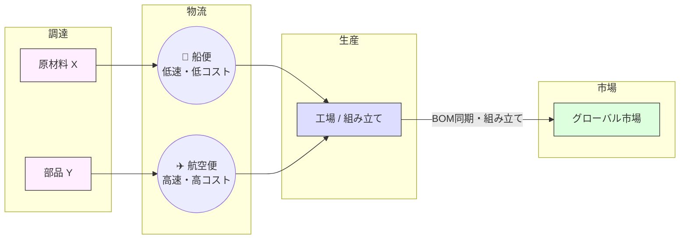
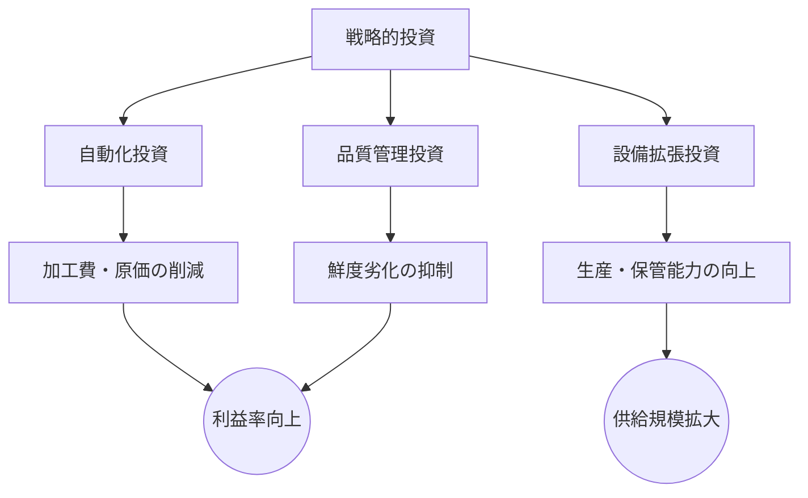
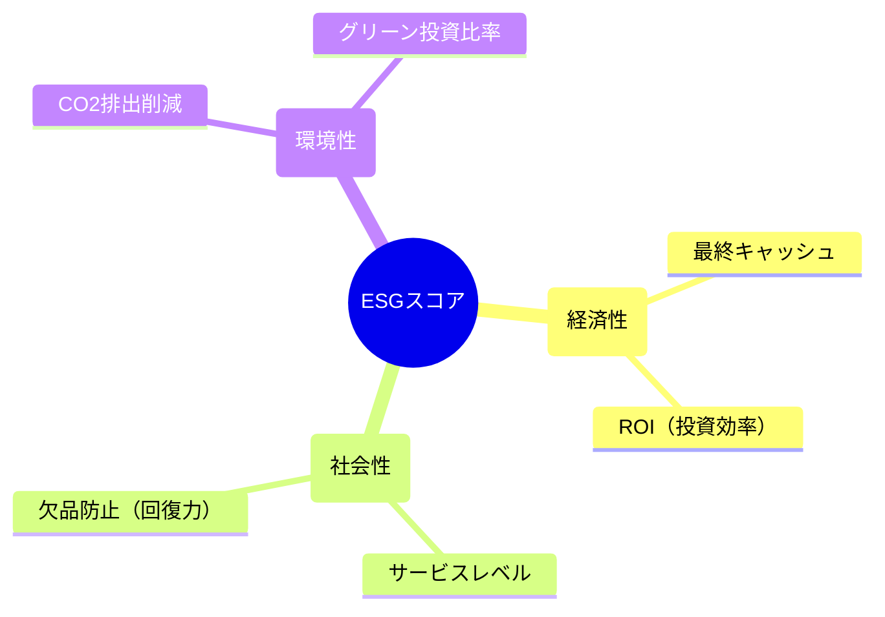

# Global Supply Chain Tycoon (グローバル・サプライチェーン・タイクーン)

## 概要
Global Supply Chain Tycoon (GSCT) は、**グローバル・サプライチェーン管理（SCM）**に焦点を当てた、高精度なリアルタイム・ビジネスシミュレーションゲームです。
グローバルな物流・製造コングロマリットのCEOとして、強靭で持続可能なサプライチェーン・ネットワークを構築してください。多段階生産（BOM）、戦略的資本投資、および高まるグリーン・トランスフォーメーション（GX）への要求のバランスを取りながら、数年間にわたる**ESGスコア**の最大化を目指します。

このシミュレーションは、現代のロジスティクスにおける根本的なトレードオフ「コスト vs 速度 vs サステナビリティ vs サービスレベル」を解決する能力をプレイヤーに問いかけます。

## 主なメカニクス

### 1. 多段階生産 (BOM と同期管理)
単なる物流管理を超えた複雑性。GSCTは**部品構成表（BOM）**システムを搭載しています：

*   **アセンブリ（組み立て）:** 完成品（例：電子機器）の製造には、複数の部材（原材料や部品）を工場へ同期させて配送する必要があります。
*   **リードタイムの同期:** 部材ごとに調達リードタイムが異なります。「ネジ一本の欠品」が組立ライン全体を停止させ、多額の損失を招くSCMの現実を再現しています。

### 2. 戦略的投資とネットワーク拡大
グローバルな足跡をデザインし、成長させます：

*   **選択的アップグレード:** 「**自動化**（コスト削減）」、「**品質管理**（鮮度維持）」、「**設備拡張**（スループット向上）」の中から、戦略に合わせて投資先を選択します。
*   **ROI分析:** 全てのアップグレードに対して、投資回収率（ROI）を推定する内蔵財務ツールを活用できます。
*   **拠点の開放:** 資本を投じて新たな戦略的拠点をアンロックし、新しい航路を開設（コミッショニング）します。

### 3. サステナビリティとグリーン・トランスフォーメーション (GX)
低炭素経済への移行を舵取りします：
*   **カーボンフットプリント:** 輸送モード（航空 vs 海上）や工場の稼働状況に応じて、リアルタイムでCO2排出量を算出。
*   **炭素税:** 排出量が多い場合、財務的なペナルティが課されます。
*   **グリーン投資:** 電気貨物船や再生可能エネルギー工場への転換により、税負担を軽減し、ESG格付けを向上させます。

### 4. 高度なロジスティクスと鮮度管理
*   **鮮度劣化:** 製品は時間の経過とともに価値を失います。高鮮度（80%以上）なら**3倍のプレミアム価格**で売れますが、鮮度低下（40%以下）は赤字の原因となります。
*   **航路の適正化 (Nautical Routing):** 船舶は運河、海峡、岬などのウェイポイントを現実的に辿ります。戦略的な海路の選択が重要です。
*   **積載率の最適化:** 「空気を運ぶ」ことを避けてください。高い積載率はユニットコスト（TCO）を下げますが、在庫保持リスクとのバランスが必要です。

### 5. リスク管理と可視化 (BI)
*   **統合イベントエンジン:** 「需要スパイク」や「地政学的リスク（航路封鎖、港湾ストライキ）」に迅速に対応してください。
*   **ビジネスインテリジェンス (BI):** 詳細な**Cost-to-Serve（製品別原価内訳）**や、配送頻度の変更が利益率に与える影響を予測する**感度分析グラフ**にアクセスできます。

## プレイ方法

1.  **期間の選択:** 1年、3年、または5年のプレイ期間を選択します。
2.  **ネットワークの設計:** 拠点をアンロックし、航路を開設し、輸送モード（航空/船）を設定します。
3.  **フローの最適化:** スライダーで配送頻度を調整します。工場での**BOM同期状態**を常に監視してください。
4.  **賢い投資:** 利益を再投資し、ROI予測に基づいて施設をアップグレードしたり、新市場へ進出したりします。
5.  **KPIの監視:** 年次報告書とリアルタイム分析を通じて、パフォーマンスを追跡します。

## ESGスコア (評価指標)
期間終了時、以下の3つの柱で評価されます：

*   **Economic (経済性):** 最終純現金とROI効率。
*   **Social (社会性):** 「Missed Sales（販売機会損失）」の最小化（サプライチェーンの回復力）。
*   **Environmental (環境性):** 総CO2排出量とグリーン投資比率。

## 使用技術
*   **フロントエンド:** HTML5 / Canvas API / Vanilla JavaScript
*   **可視化:** D3.js (Map & Data Viz), TopoJSON
*   **アーキテクチャ:** 高い保守性を実現する「仮想モジュール」パターン

## ライセンス
このプロジェクトは MIT ライセンスの下でライセンスされています。

---
[English README](./README.md)
